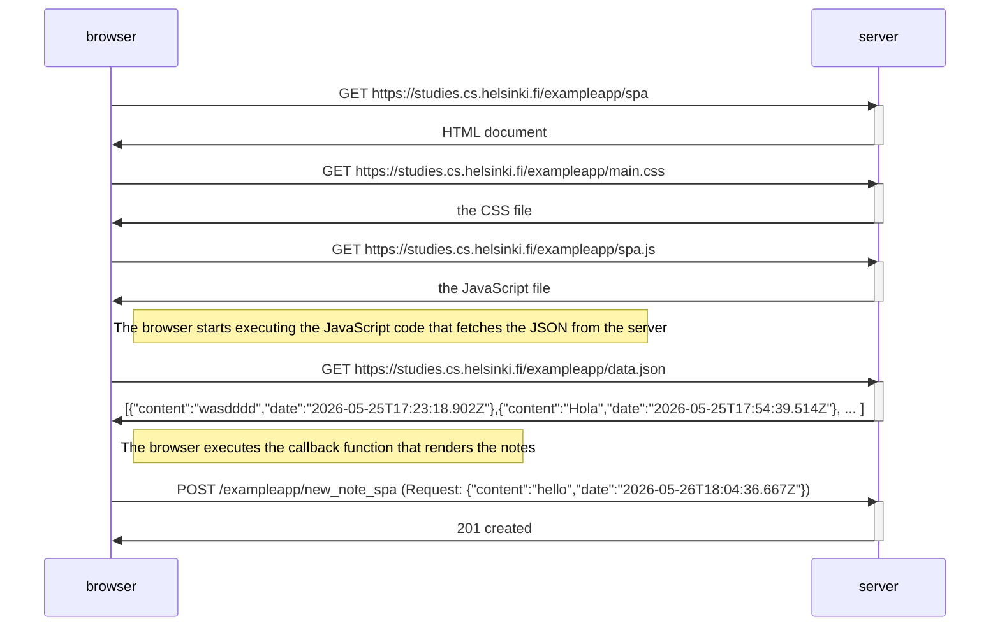

```mermaid
sequenceDiagram
  participant browser
  participant server

browser->>server: GET https://studies.cs.helsinki.fi/exampleapp/spa
activate server
server->>browser: HTML document
deactivate server

browser->>server: GET https://studies.cs.helsinki.fi/exampleapp/main.css
activate server
server->>browser: the CSS file
deactivate server

browser->>server: GET https://studies.cs.helsinki.fi/exampleapp/spa.js
activate server
server->>browser: the JavaScript file
deactivate server

Note right of browser: The browser starts executing the JavaScript code that fetches the JSON from the server

browser->>server: GET https://studies.cs.helsinki.fi/exampleapp/data.json
activate server
server->>browser: [{"content":"wasdddd","date":"2026-05-25T17:23:18.902Z"},{"content":"Hola","date":"2026-05-25T17:54:39.514Z"}, ... ]
deactivate server

Note right of browser: The browser executes the callback function that renders the notes

browser->>server: POST /exampleapp/new_note_spa (Request: {"content":"hello","date":"2026-05-26T18:04:36.667Z"})
activate server
server->>browser: 201 created
deactivate server

```
